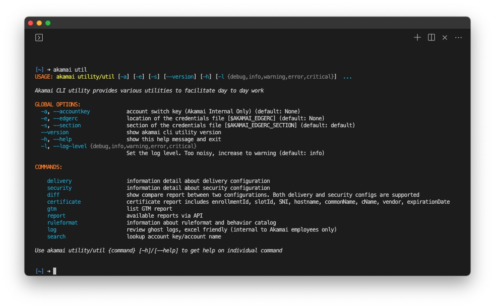

# Introduction

The `akamai utility` is designed to enhance efficiency and productivity. This command-line interface (CLI) is inspired by customer requests and has been developed to benefit both Akamai customers and internal Akamai employees. By encapsulating complex API calls into user-friendly commands, the utility facilitates tasks that involve Akamai services, offering a streamlined and efficient experience.

# Key Features

- **Versatile Functionality**: `akamai utility` offers a range of commands that cater to various needs, ensuring a seamless experience for users.
- **Excel Output**: Most commands generate results in Excel format, promoting ease of analysis and interpretation. The output files are stored in the `output` folder.
- **XML Handling**: For commands involving XML data, `akamai utility` provides options to display XML results in the terminal. Line numbers can be toggled, ensuring readability. When XML is incorporated into Excel files, character counts are included due to Excel's 32,767 character limitation per cell.
- **Account-Wide Analysis**: To expedite requests for specific commands, the `--concurrency` argument allows users to analyze account-wide information efficiently. Users are advised to consider rate limiting associated with their credentials.

# Installation

To install the utility execute command `akamai install utility`

# Usage

`akamai utility` can be accessed using the alias `util`, substituting the need for `utility`. For a list of available top-level commands, refer to the help menu

```bash
akamai utility/util -h/--help
```



# Commands

- ### self - TBD
- ### [diff](https://github.com/akamai/cli-utility/tree/main/bin/doc/diff.md)

- ### [delivery](https://github.com/akamai/cli-utility/tree/main/bin/doc/delivery.md)

  - ##### [ruleformat](https://github.com/akamai/cli-utility/tree/main/bin/doc/ruleformat.md)
  - ##### [bulk](https://github.com/akamai/cli-utility/tree/main/bin/doc/bulk.md)
  - ##### [certificate](https://github.com/akamai/cli-utility/tree/main/bin/doc/certificate.md)
  - ##### [cpcode](https://github.com/akamai/cli-utility/tree/main/bin/doc/cpcode.md)

- ### [security](https://github.com/akamai/cli-utility/tree/main/bin/doc/security.md)

- ### [report](https://github.com/akamai/cli-utility/tree/main/bin/doc/gtm.md)

  - ##### [gtm](https://github.com/akamai/cli-utility/tree/main/bin/doc/gtm.md)

- ### Internal to Akamai Employees only
  - ##### [search](https://github.com/akamai/cli-utility/tree/main/bin/doc/search.md)
  - ##### [log](https://github.com/akamai/cli-utility/tree/main/bin/doc/log.md)

# Contribution

By submitting a contribution (the “Contribution”) to this project, and for good and valuable consideration, the receipt and sufficiency of which are hereby acknowledged, you (the “Assignor”) irrevocably convey, transfer, and assign the Contribution to the owner of the repository (the “Assignee”), and the Assignee hereby accepts, all of your right, title, and interest in and to the Contribution along with all associated copyrights, copyright registrations, and/or applications for registration and all issuances, extensions and renewals thereof (collectively, the “Assigned Copyrights”). You also assign all of your rights of any kind whatsoever accruing under the Assigned Copyrights provided by applicable law of any jurisdiction, by international treaties and conventions and otherwise throughout the world.

## Local Install

For local installation, follow these steps:
Depending on your local python setup,
replace `python with python3` and `pip with pip3`

```
git clone https://github.com/akamai/cli-utility
cd cli-utility
pwd
pre-commit install
git checkout -b [branchname]
python -m venv .venv
source .venv/bin/activate
pip install --upgrade pip
pip install -r requirements.txt
```

## Test as akamai cli

Assuming result from above `pwd` command returns `/Users/Documents/cli-utility`
You don't need to run `akamai uninstall utility` if you never install it. This steps will uninstall production version and allow you to verify local branch
You can run `akamai install file://C:/Users/sample/cli-utlity` anywhere. It doesn't have to be the location where you ran `git clone`

#### Mac OS users,

```bash
akamai uninstall utility
akamai install file:///Users/Documents/cli-utility
```

#### Window users

```bash
akamai uninstall utility
akamai install file://C:/Users/sample/cli-utlity
```

# Notice

Copyright 2023 – Akamai Technologies, Inc.

All works contained in this repository, excepting those explicitly otherwise labeled, are the property of Akamai Technologies, Inc.
