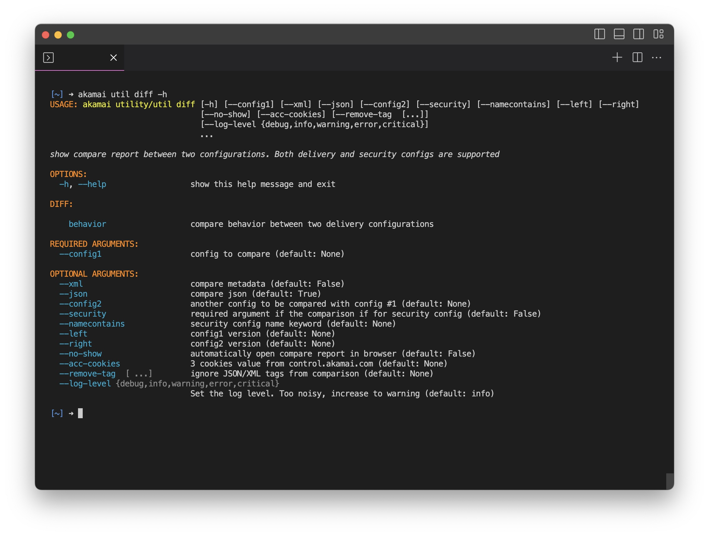
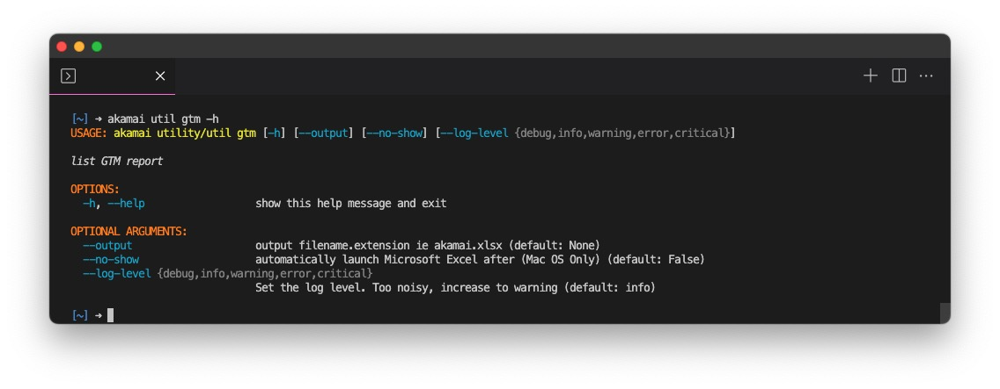
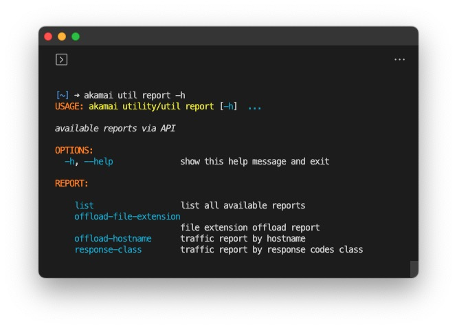

# Introduction

The `akamai utility` is designed to enhance efficiency and productivity. This command-line interface (CLI) is inspired by customer requests and has been developed to benefit both Akamai customers and internal Akamai employees. By encapsulating complex API calls into user-friendly commands, the utility facilitates tasks that involve Akamai services, offering a streamlined and efficient experience.

# Key Features

- **Versatile Functionality**: `akamai utility` offers a range of commands that cater to various needs, ensuring a seamless experience for users.
- **Excel Output**: Most commands generate results in Excel format, promoting ease of analysis and interpretation. The output files are stored in the `output` folder.
- **XML Handling**: For commands involving XML data, `akamai utility` provides options to display XML results in the terminal. Line numbers can be toggled, ensuring readability. When XML is incorporated into Excel files, character counts are included due to Excel's 32,767 character limitation per cell.
- **Account-Wide Analysis**: To expedite requests for specific commands, the `--concurrency` argument allows users to analyze account-wide information efficiently. Users are advised to consider rate limiting associated with their credentials.

# Installation

To install the utility execute command `akamai install utility`

# Usage

`akamai utility` can be accessed using the alias `util`, substituting the need for `utility`. For a list of available top-level commands, refer to the help menu

```bash
akamai utility/util -h/--help
```


# Delivery Command

`delivery` command offers a comprehensive overview of properties associated with the account. This information includes group ID, contract ID, version details (latest, staging, production), last update timestamp, product ID, hostname count, and a list of hostnames.


`--summary` argument provides a structural overview of [Property Groups structures](https://control.akamai.com/apps/property-manager/#/groups) and the count of properties within each group. Unlike the order displayed on Akamai Control Center portal, CLI organizes groups and properties alphabetically.

```bash
akamai util delivery --summary --show
```

For detailed property information, the `--summary` argument can be omitted. Additionally, the `--behavior` argument facilitates checks for specific behaviors implemented by properties. Multiple behaviors are supported.

```bash
akamai util delivery --show --behavior adaptiveAcceleration allowPost \
    cacheKeyIgnoreCase caching cpCode downstreamCache enhancedAkamaiProtocol \
    failAction gzipResponse http2 imageManager mPulse \
    modifyOutgoingResponseHeader origin prefetch prefetchable redirect report \
    setVariable siteShield sureRoute
```

`delivery` command features seven subcommands:

- [behavior](#delivery-behavior)
- [custom-behavior](#delivery-custom-behavior)
- [metadata](#delivery-metadata)
- [hostname-cert](#delivery-hostname-cert)
- [origin-cert](#delivery-origin-cert)
- [ruletree](#delivery-ruletree)
- [activate]()

detailed arguments for each subcommand can be accessed using the `-h/--help` option:

```bash
akamai util delivery [subcommand] -h
```

## Delivery Behavior

To view all behaviors associated with a property

```bash
akamai util delivery behavior --property sample
```

## Delivery Custom-Behavior

To retrieve a list of all custom behaviors on the account

```bash
akamai util delivery custom-behavior
akamai util delivery custom-behavior --hidexml
akamai util delivery custom-behavior --id cbe_382209004 cbe_314399535
akamai util delivery custom-behavior --id cbe_382209004 cbe_314399535 --lineno
akamai util delivery custom-behavior --namecontains IPA --hidexml
```

## Delivery Metadata

To get advanced criteria, advanced behavior and advanced override on a property. Multiple properties are supported.

```bash
akamai util delivery metadata
akamai util delivery metadata --property SANDBOX SANDBOX_2
akamai util delivery metadata --property SANDBOX --hidexml
akamai util delivery metadata --property SANDBOX --lineno
```

## Delivery Hostname-Cert

To obtain a list of hostnames and corresponding edge hostnames on a property and whether they are CPS managed or Secure By Default. Multiple properties are supported.

```bash
akamai util delivery hostname-cert --property A B C D
```

## Delivery Netstorage

To get netstorage details utilized by properties on the account. Optionally, you can filter by groupId or by property.

```bash
akamai util delivery netstorage --concurrency 10
akamai util delivery netstorage --group-id 11111 11112 11113 --concurency 5
akamai util delivery netstorage --property A B C D
```

## Delivery Origin-Cert

To retrieve certificate information for all origins on a property
Note that properties implement Site Shield are exempt due to limitations. The command offers Site Shield map details and a list of CIDR and IPs.

```bash
akamai util delivery origin-cert
akamai util delivery origin-cert  --group-id 11111 11112 11113
akamai util delivery origin-cert  --property A B C D
```

## Delivery Ruletree

To obtain a hierarchical representation of a property's ruletree structure. For deep nested rules, utilize the `--show-depth` argument to identify the highest depth. The `--show-limit` argument reveals other delivery configuration limits.

# Security

The security command facilitates the download of security configurations for the account. A list of CIDR and IP addresses are provided for configurations with network lists.


## security hostname

This subcommand offers a list of hostnames active exclusively on the Akamai staging network, not yet added to the security configuration.

```bash
akamai util security hostname
```

# diff

`diff` command supports both delivery and security configuration, both JSON and XML format. You can also compare 2 different delivery configurations.

- For delivery config, specify the configuration name.
- For security config, use the configuration ID.

```bash
akamai util diff --config1 sample_pm --left 1 --right 2
akamai util diff --config1 A --left 1 --config2 B --right 2
akamai util diff --config1 sample_pm --left 1 --right 2  --remove-tag uuid --no-show
akamai util diff --security --config1 34076 --left 71 --right 72
akamai util diff --security --config1 34076 --left 71 --right 72 \
    --xml --json \
    --acc-cookies "XSRF-TOKEN=MjA2YzYxOGItYzY2MS00NDkzLTg3NmEtMzE5MzllMDM0YmMy;AKATOKEN=dG9rZW5fRVpDOjE6QUVTL0dDTS9QS0NTNVBhZGRpbmc6WXZHdWM0S0xtOUhlQmJSb0w2NUluQT09LDEyODoCxTw8yfsSvMg7l6/mcA+Ap8ERnFZ780P9sZtDxA2vRlTESW1MrvyLnPvyN/DcE1T9yPCb;AKASSO=Y2EyYjQ3MTMtNTdkNy00Y2ViLWJhYTItNmFlYzQ3NDMyYThm;"
```



`diff` command has 1 subcommand:

- [behavior](#delivery-behavior)

## Diff Behavior

This subcommand extracts requested behaviors and criteria from JSON ruletrees in delivery configurations. It provides output in xlsx format, streamlining the process for Excel pivot table analysis.

```bash
akamai util diff behavior --property A B C D
akamai util diff behavior --property A B C D --behavior origin --criteria path
akamai util diff behavior --property A B C D --behavior origin --criteria None
```

# Certificate

The `certificate` command offers detailed information about certificates provisioned by the Akamai Certificate Provisioning System (CPS).
Filtering can be done using options like `--sni`, `--expire`, and `--authority`.

```bash
akamai util certificate
akamai util certificate --expire --sni
akamai util certificate --slot 3024 7176 9977
akamai util certificate --authority geotrust --enrollement-id 19569 18843
```


# GTM

Provides a normalized report of the GTM domain and its properties.



## GTM Remove

Batch delete GTM properties based on a given CSV input

# Report



`report` command features four subcommands:

- [list](#report-list)
- [offload-url](#report-offload-url)
- [offload-hostname](#report-offload-hostname)
- [response-class](#report-response-class)

## Report List

Give you a list of available reports are its metadata such as data retention days, API endpoint, available metrics and filters

```bash
akamai util report list --type cpcode
akamai util report list --namecontains error
```

## Report Offload-file-extension

Provide edge_hits, origin_hits and the offload percentage for each file extension of given cpCodes

```bash
akamai util report offload-file-extension --cpcode 1051280 1051283 1051285 --last 90 --interval DAY
```

## Report Offload-hostname

Provide edgeHits on the hostname and corresponding delivery configuration

```bash
akamai util report offload-hostname
akamai util report offload-hostname --last 2 --interval WEEK
```

## Report Response-class

Provide the percentage of edgeHits and originHits by response code class for the requested cpCode along with its cpCode name.

```bash
akamai util report response-class --last 2 --interval WEEK --concurrency 5
akamai util report response-class --last 7 --interval HOUR --cpcode 1051280 1051283 1051285
```

# Ruleformat

The `ruleformat` command provides JSON format from delivery configurations that match a given product ID and rule format version.
This JSON is valuable for referencing during activation issues.
The command also aids in obtaining JSON schema and snippet samples for specific behaviors.


```bash
# Retrieve all behaviors of prd_SPM's latest version in xlsx format
akamai util ruleformat --product-id prd_SPM --version latest --xlsx

# Filter behavior containing the keyword "origin"
akamai util ruleformat --product-id prd_SPM --version latest \
    --behavior origin

# Obtain JSON schema and sample for behavior containing the keyword "conditionalOrigin"
akamai util ruleformat --product-id prd_SPM --version latest \
    --behavior conditionalOrigin --json --sample

# Retrieve JSON schema in both JSON and table formats, along with a snippet sample
akamai util ruleformat --product-id prd_SPM --version latest \
    --behavior conditionalOrigin --json --sample --table
```

# search

For users managing multiple accounts, the search command aids in finding the account switch key.


```bash
akamai util search --account "TC East" "TC West"
```


# Contribution

By submitting a contribution (the “Contribution”) to this project, and for good and valuable consideration, the receipt and sufficiency of which are hereby acknowledged, you (the “Assignor”) irrevocably convey, transfer, and assign the Contribution to the owner of the repository (the “Assignee”), and the Assignee hereby accepts, all of your right, title, and interest in and to the Contribution along with all associated copyrights, copyright registrations, and/or applications for registration and all issuances, extensions and renewals thereof (collectively, the “Assigned Copyrights”). You also assign all of your rights of any kind whatsoever accruing under the Assigned Copyrights provided by applicable law of any jurisdiction, by international treaties and conventions and otherwise throughout the world.

## Local Install

For local installation, follow these steps:
Depending on your local python setup,
replace `python with python3` and `pip with pip3`

```
git clone https://github.com/akamai/cli-utility
cd cli-utility
pwd
pre-commit install
git checkout -b [branchname]
python -m venv .venv
source .venv/bin/activate
pip install --upgrade pip
pip install -r requirements.txt
```

## Test as akamai cli

Assuming result from above `pwd` command returns `/Users/Documents/cli-utility`
You don't need to run `akamai uninstall utility` if you never install it. This steps will uninstall production version and allow you to verify local branch
You can run `akamai install file://C:/Users/sample/cli-utlity` anywhere. It doesn't have to be the location where you ran `git clone`

Mac OS users,

```bash
akamai uninstall utility
akamai install file:///Users/Documents/cli-utility
```

Window users

```bash
akamai uninstall utility
akamai install file://C:/Users/sample/cli-utlity
```

# Notice

Copyright 2023 – Akamai Technologies, Inc.

All works contained in this repository, excepting those explicitly otherwise labeled, are the property of Akamai Technologies, Inc.
