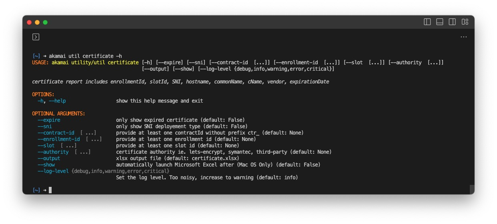

# Certificate

The `certificate` command offers detailed information about certificates provisioned by the Akamai Certificate Provisioning System (CPS).
Filtering can be done using options like `--sni`, `--expire`, and `--authority`.

```bash
akamai util certificate
akamai util certificate --expire --sni
akamai util certificate --slot 3024 7176 9977
akamai util certificate --authority geotrust --enrollement-id 19569 18843
```


