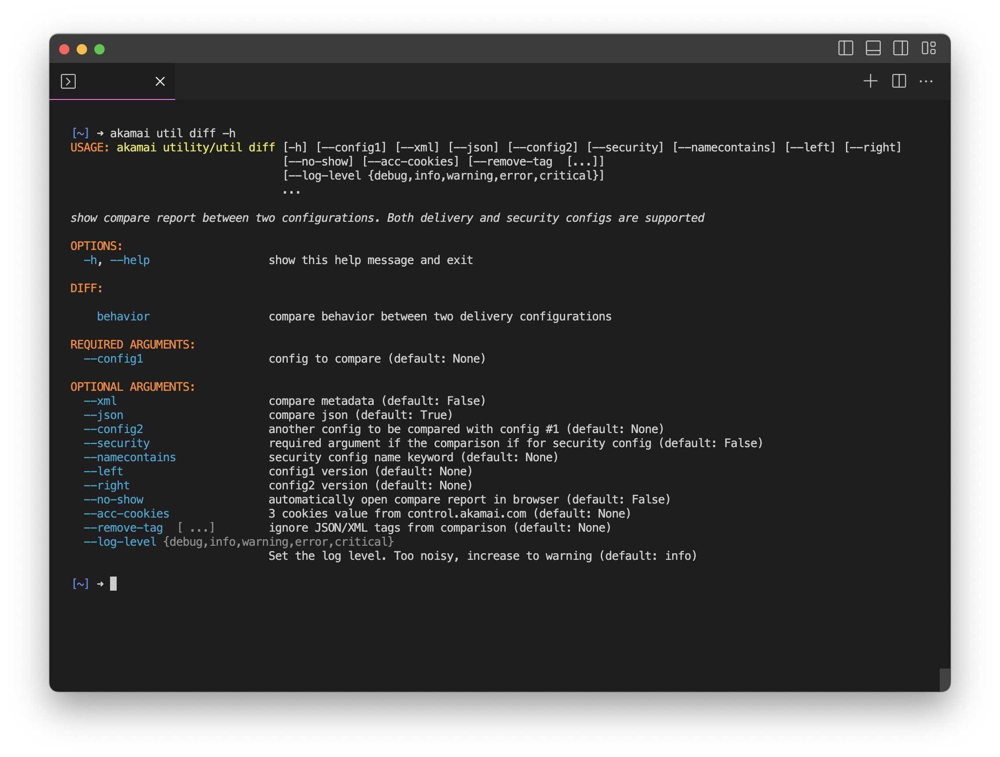

# diff

`diff` command supports both delivery and security configuration, both JSON and XML format. You can also compare 2 different delivery configurations.

- For delivery config, specify the configuration name.
- For security config, use the configuration ID.

```bash
akamai util diff --config1 sample_pm --left 1 --right 2
akamai util diff --config1 A --left 1 --config2 B --right 2
akamai util diff --config1 sample_pm --left 1 --right 2  --remove-tag uuid --no-show
akamai util diff --security --config1 34076 --left 71 --right 72
akamai util diff --security --config1 34076 --left 71 --right 72 \
    --xml --json \
    --acc-cookies "XSRF-TOKEN=MjA2YzYxOGItYzY2MS00NDkzLTg3NmEtMzE5MzllMDM0YmMy;AKATOKEN=dG9rZW5fRVpDOjE6QUVTL0dDTS9QS0NTNVBhZGRpbmc6WXZHdWM0S0xtOUhlQmJSb0w2NUluQT09LDEyODoCxTw8yfsSvMg7l6/mcA+Ap8ERnFZ780P9sZtDxA2vRlTESW1MrvyLnPvyN/DcE1T9yPCb;AKASSO=Y2EyYjQ3MTMtNTdkNy00Y2ViLWJhYTItNmFlYzQ3NDMyYThm;"
```



`diff` command has 1 subcommand:

- [behavior](#delivery-behavior)

## Diff Behavior

This subcommand extracts requested behaviors and criteria from JSON ruletrees in delivery configurations. It provides output in xlsx format, streamlining the process for Excel pivot table analysis.

```bash
akamai util diff behavior --property A B C D
akamai util diff behavior --property A B C D --behavior origin --criteria path
akamai util diff behavior --property A B C D --behavior origin --criteria None
```
