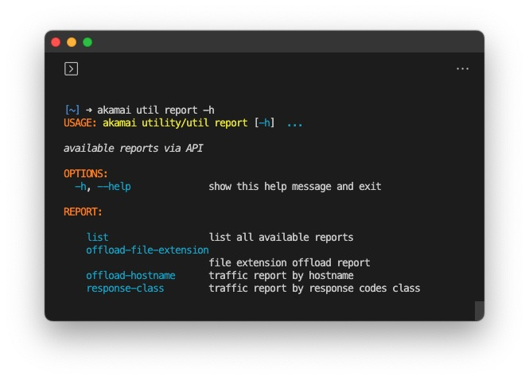

# Report



`report` command features four subcommands:

- [list](#report-list)
- [offload-url](#report-offload-url)
- [offload-hostname](#report-offload-hostname)
- [response-class](#report-response-class)

## Report List

Give you a list of available reports are its metadata such as data retention days, API endpoint, available metrics and filters

```bash
akamai util report list --type cpcode
akamai util report list --namecontains error
```

## Report Offload-file-extension

Provide edge_hits, origin_hits and the offload percentage for each file extension of given cpCodes

```bash
akamai util report offload-file-extension --cpcode 1051280 1051283 1051285 --last 90 --interval DAY
```

## Report Offload-hostname

Provide edgeHits on the hostname and corresponding delivery configuration

```bash
akamai util report offload-hostname
akamai util report offload-hostname --last 2 --interval WEEK
```

## Report Response-class

Provide the percentage of edgeHits and originHits by response code class for the requested cpCode along with its cpCode name.

```bash
akamai util report response-class --last 2 --interval WEEK --concurrency 5
akamai util report response-class --last 7 --interval HOUR --cpcode 1051280 1051283 1051285
```
