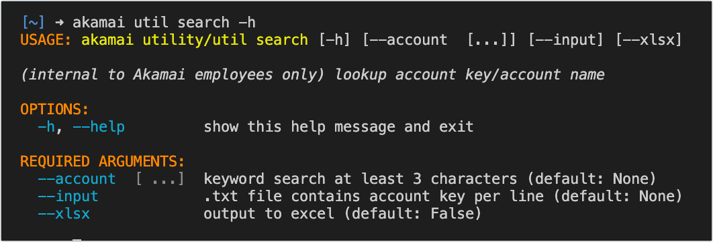
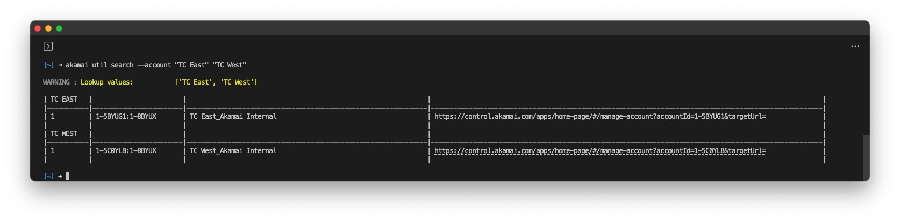
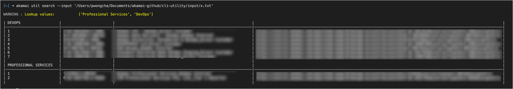

# search

For users managing multiple accounts, the search command aids in finding the account switch key.



```bash
akamai util search --account "TC East" "TC West"
```



```bash
akamai util search --input x.txt
```


