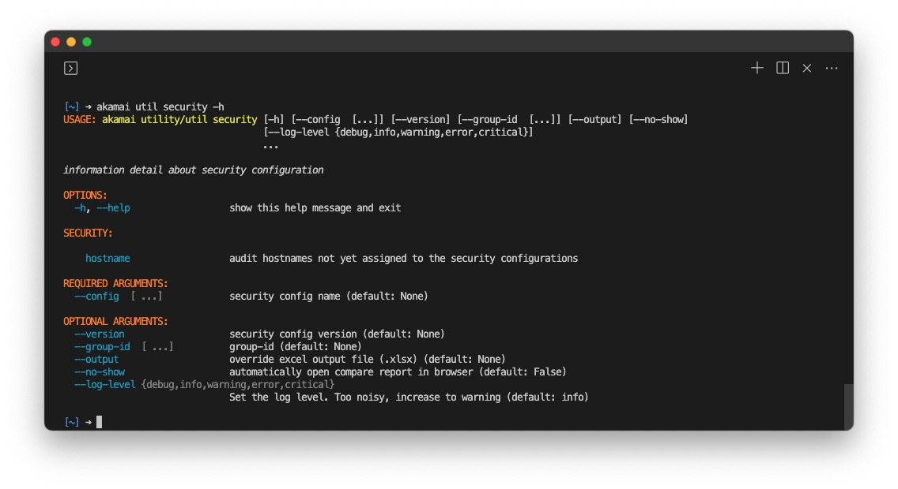

# Security

The security command facilitates the download of security configurations for the account. A list of CIDR and IP addresses are provided for configurations with network lists.



## security hostname

This subcommand offers a list of hostnames active exclusively on the Akamai staging network, not yet added to the security configuration.

```bash
akamai util security hostname
```
